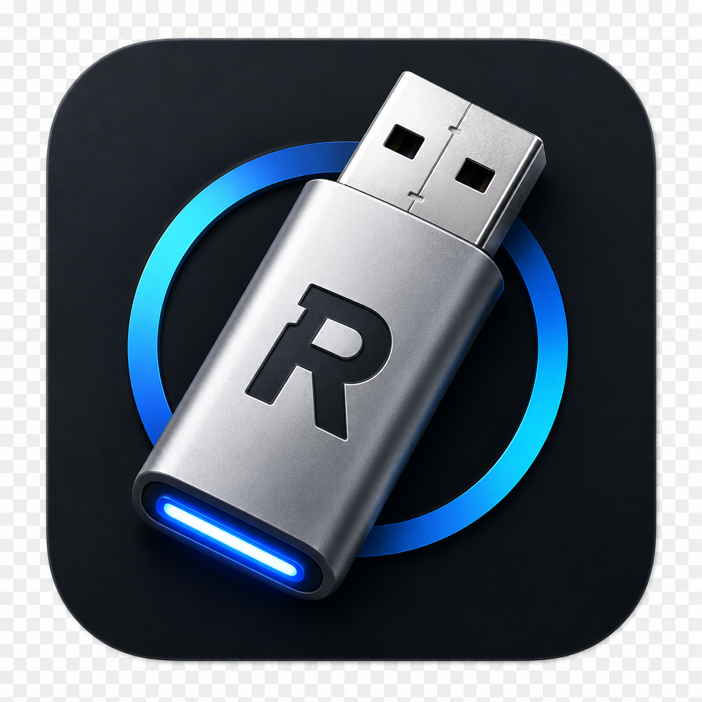

<div align="center">



# RufusMac

### The Rufus-style bootable USB creator for macOS — with a true Liquid Glass interface.

**Create bootable Windows, Linux, and other USB installers from your Mac.** Single-ISO writing, Ventoy-style multiboot, Linux persistence, automatic checksum verification, and a built-in Windows 11 TPM / Secure Boot / online-account bypass — wrapped in Apple's native Liquid Glass design.


_A single-window, native **Liquid Glass** app — mode switcher, live USB detection, drag-and-drop ISO, and a one-tap **START**. Grab it from [Releases](https://github.com/h4rithd/RufusMac/releases) to see it in motion._

</div>

> **Why?** [Rufus](https://rufus.ie) is the gold standard for making bootable USBs — but it's **Windows-only**. On macOS you're stuck juggling `balenaEtcher` (Linux only), `WinDiskWriter` (Windows only), and `Ventoy` (Terminal-heavy). And almost every Mac tool **struggles with Windows 11 installers**. RufusMac brings it all together in one beautiful, native app.

> 🤖 **RufusMac was designed and built with the help of [Claude Code](https://claude.com/claude-code)**, Anthropic's agentic coding tool.

---

## ✨ Features

### Everything you expect (Rufus parity)
- 🔌 **Smart device detection** — external/removable USB drives only; your internal disk is *never* listed.
- 💿 **Write any image** — ISO / IMG / DMG, Windows or Linux, auto-detected.
- 🧩 **Partition scheme** — MBR or GPT.
- 🖥️ **Target system** — UEFI or BIOS/UEFI.
- 🗂️ **File systems** — FAT32 / exFAT / NTFS.
- 🏷️ **Volume label**, quick format, and advanced options.
- 🔁 **Auto-defaults** — RufusMac picks sensible settings from the ISO you choose.

### Things people actually want (and most Mac tools lack)
- 🪟 **Windows 11 bypass, built in** — skip the **TPM 2.0, Secure Boot, RAM/CPU** checks *and* the **online-account** requirement, automatically.
- 🧱 **Large `install.wim` handling** — auto-splits `install.wim` > 4 GB into `.swm` so Windows boots from FAT32 (no NTFS gymnastics).
- 🗃️ **Ventoy-style Multiboot** *(experimental)* — set up the drive once, then **drag many ISOs** onto it and boot any one from a menu.
- 💾 **Linux persistence** — keep your changes between live-USB sessions.
- ✅ **Automatic checksum verification** — verify the image before writing and the drive after (SHA-256).
- 📚 **Built-in ISO catalog** — jump straight to official downloads for Ubuntu, Fedora, Debian, Mint, Arch, Kali, Tails, Windows, and more.
- ♻️ **Reclaim drive** — one click to turn a bootable USB back into a normal, usable disk.
- 🖱️ **Drag-and-drop** ISO selection.
- 🛡️ **Safety first** — every destructive action shows a full command preview and requires explicit confirmation. A **dry-run "Preview only"** mode runs nothing.
- 🧰 **`rmctl` CLI** — list drives, preview command pipelines, browse the catalog, and verify checksums from the terminal.
- 🎨 **Native Liquid Glass UI** — built in SwiftUI for macOS 26 (Tahoe). Adaptive light/dark, Apple-silicon native.

## 🆚 How it compares

| | **RufusMac** | Rufus | balenaEtcher | Ventoy | WinDiskWriter |
|---|:--:|:--:|:--:|:--:|:--:|
| Runs on macOS | ✅ | ❌ | ✅ | ⚠️ CLI | ✅ |
| Native Liquid Glass UI | ✅ | — | ❌ | ❌ | ❌ |
| Windows ISO → USB | ✅ | ✅ | ⚠️ | ✅ | ✅ |
| Linux ISO → USB | ✅ | ✅ | ✅ | ✅ | ❌ |
| Windows 11 TPM/Secure Boot bypass | ✅ | ✅ | ❌ | ✅ | ⚠️ |
| Multiboot (many ISOs) | ⚗️ exp. | ❌ | ❌ | ✅ | ❌ |
| Linux persistence | ✅ | ✅ | ❌ | ✅ | ❌ |
| Checksum verification | ✅ | ✅ | ✅ | ✅ | ❌ |
| Command preview / dry-run | ✅ | ❌ | ❌ | ❌ | ❌ |
| Built-in ISO catalog | ✅ | ⚠️ | ❌ | ❌ | ❌ |
| CLI companion | ✅ | ❌ | ✅ | ✅ | ❌ |
| Open source | ✅ GPLv3 | ✅ | ✅ | ✅ | ✅ |

## 📦 Install

1. Download **`RufusMac.dmg`** from the [latest release](https://github.com/h4rithd/RufusMac/releases).
2. Open it and drag **RufusMac** to Applications.
3. First launch: **right-click → Open** (the app is unsigned open-source software, so Gatekeeper asks once).

Verify your download: `shasum -a 256 RufusMac.dmg` and compare with the published `.sha256`.

> Requires **macOS 26 (Tahoe) or later** on Apple silicon.

## 🚀 Usage

1. **Plug in a USB drive** and pick it under **Device**.
2. Choose a mode: **Single ISO**, **Multiboot**, **DD Image**, or **Reclaim**.
3. **Drag in an ISO** (or click *Browse catalog* to download one).
4. Tweak options if you like — RufusMac pre-fills sensible defaults.
5. Press **START**, review the plan + warnings, then **Preview only** (safe dry-run) or **Erase & Write**.

### `rmctl` — the CLI companion
```bash
rmctl list                  # show external/removable drives (read-only)
rmctl preview windows X.iso # dry-run the exact command pipeline (nothing runs)
rmctl catalog               # browse the bundled ISO catalog
rmctl verify file.iso <sha256>
```

## 🛠️ Build from source

```bash
git clone git@github.com:h4rithd/RufusMac.git
cd RufusMac
swift build -c release          # builds with the Command Line Tools (no full Xcode needed)
scripts/make_dmg.sh             # produces dist/RufusMac.dmg
scripts/fetch_thirdparty.sh     # (optional) bundle wimlib/ventoy/e2fsprogs for Windows + Multiboot
```
Run the tests (requires Xcode for the Swift Testing framework):
```bash
swift test
```

## 🔒 Safety

RufusMac is built to **never touch your internal disk**:
- Only **external, physical, removable** disks are ever listed (verified against `diskutil`).
- Every write shows the **exact commands** and a red, explicit confirmation.
- A **dry-run** mode prints the plan without executing anything.
- All privileged work runs through a **single** macOS administrator prompt.

Writing to a USB **erases everything on it** — double-check the device you select.

## 🧠 How it works

A clean two-layer design: a pure-Swift engine (`RufusMacKit`) handles disk enumeration, image inspection, and command planning; the SwiftUI app renders it on Liquid Glass. Destructive work is assembled into one auditable shell pipeline using `diskutil` / `hdiutil` / `dd` plus bundled `wimlib-imagex` / `mke2fs` / Ventoy. See [docs/ARCHITECTURE.md](docs/ARCHITECTURE.md).

## 🗺️ Roadmap

- ✅ Liquid Glass UI, live device detection, dd/Linux writer, Windows writer + Win11 bypass, reclaim, ISO catalog, checksum verify, dry-run preview, `rmctl` CLI, portable `.dmg`.
- ⚗️ **Experimental:** Ventoy-style multiboot, Linux persistence (need real-hardware validation).
- 🔜 In-app downloader with live progress, real-time write progress bar, presets & recents, signing + notarization, localization.

> **Status:** functional preview (`v0.1`). Linux and Reclaim use only built-in macOS tools; Windows/Multiboot need the bundled third-party tools (`scripts/fetch_thirdparty.sh`). Real bootable-media testing on target hardware is recommended before relying on it.

## 🙌 Credits & acknowledgements

- **[Rufus](https://rufus.ie)** by Pete Batard — the inspiration and the gold standard.
- **[Ventoy](https://www.ventoy.net)** — the multiboot engine concept.
- **[wimlib](https://wimlib.net)** — WIM splitting.
- Built with the help of **[Claude Code](https://claude.com/claude-code)**.

## 📄 License

[GPLv3](LICENSE) © **Harith Dilshan** — consistent with the Rufus/Ventoy open-source lineage.

---

<div align="center">

**Developed by [Harith Dilshan](https://h4rithd.com) · [h4rithd.com](https://h4rithd.com)**

</div>
